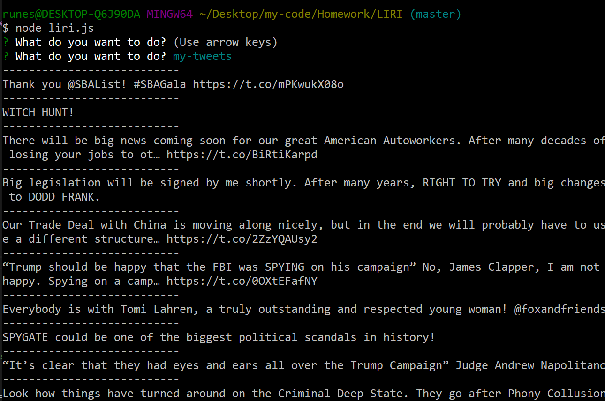
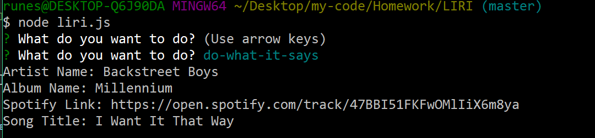

# LIRI
LIRI is a Language Interpretation and Recognition Interface using the command line node app.

Twitter Example:

Spotify Example:

Movies Example:

Do-what-it-says Example:

## Getting Started

Open up and download the [project link](https://github.com/hannahlim213/LIRI) 

### Installing

* npm 
* Windows - Git Bash
* Mac - Command Line

## Built With

* [Javascript](https://www.javascript.com/) - programming language
* [Node.js](https://nodejs.org/en/) - javascript runtime

## NPM Packages
* [Twitter](https://www.npmjs.com/package/twitter)
* [Node-Spotify-API](https://www.npmjs.com/package/node-spotify-api)
* [request](https://www.npmjs.com/package/request)
* [dotenv](https://www.npmjs.com/package/dotenv)
* [inquirer](https://www.npmjs.com/package/inquirer)

## Author

* **Hannah Lim** - [hannahlim213](https://github.com/hannahlim213)

## License

This project is licensed under the MIT License - see the [LICENSE.md](LICENSE.md) file for details
